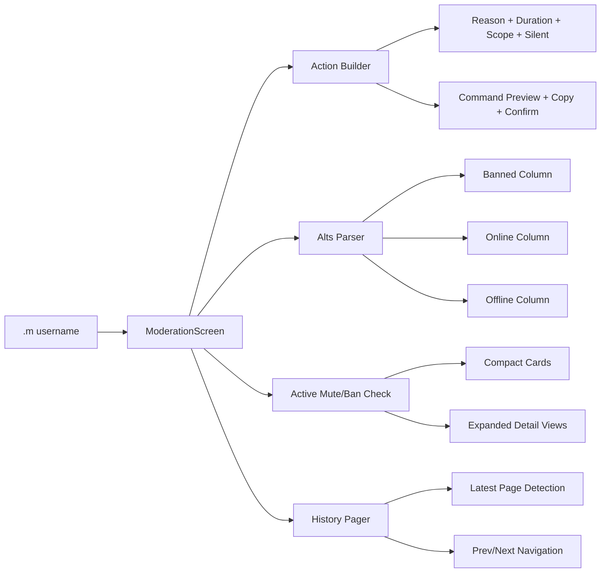

# Mineberry Moderation Panel

<p align="center">
  
  
  
  
  
</p>

A custom Fabric client moderation utility for Mineberry workflows.  
It opens a rich moderation screen from chat and combines punish actions, alt-analysis, active punishment checks, and history browsing in one panel.

---

## What It Solves

Moderating in busy chat is slow when every lookup and action is separate.  
This panel centralizes everything under one command:

```text
.m <username>
```

From there, you can inspect alts, check active bans/mutes, browse punishment history pages, and issue warn/mute/ban actions with structured options.

---

## Feature Highlights

### 1) Unified Moderation Workflow
- Open panel from chat command: `.m <username>`
- One screen for actions + intelligence + status
- Click any alt name to pivot directly into that user's panel

### 2) Actions (Warn / Mute / Ban)
- Built-in reason picker + custom reason input
- Duration handling with unit selection
- Server scope selection:
  - `server:surv`
  - `server:anarchy`
  - `server:opsurv`
  - `server:*`
  - `server:kitpvp` with sub-choice:
    - `server:kitpvp-1`
    - `server:kitpvp-2`
    - Both (runs two separate commands)
- Silent toggle (`-s`) support
- Live command preview + one-click copy

### 3) Smart Duration Rules
- Minutes are auto-converted to seconds before command send
  - Example: `10 minutes` -> `600s`
- Months use `m`

### 4) Alt Detection by Color/Status
Parses styled chat alt output and classifies into:
- Banned
- Online
- Offline

With independent scrollable columns and direct click-to-open targeting.

### 5) Active Mutes / Active Bans Panels
- Auto-runs checks in lookup session
- Parses key fields (actor, reason, duration, server, flags)
- Expand view for detailed inspection
- Copy details to clipboard

### 6) Punishment History Browser with Paging
- Auto-load latest history page using:
  - `history <user>`
- Detects and tracks `page X of Y`
- `Prev` / `Next` paging controls:
  - `history <user> <page>`
- Structured per-entry rendering:
  - Ban metadata (actor/date/duration/reason/server/status)
  - Unban is attached to its corresponding ban entry when present

### 7) Command Queueing for Multi-Target Actions
- Multi-command actions (e.g. KitPvP both) are sent as separate commands
- 1.5 second spacing between chained commands

### 8) Lookup Chat Suppression
When panel-triggered checks run, lookup output is suppressed from regular chat view so moderation data does not clutter gameplay chat.

### 9) QoL Input
- Press `.` to open chat prefilled with `.`
- Standard `/` chat behavior remains unchanged

---

## Command Reference

### Open Panel
```text
.m <username>
```

### Commands Sent by Panel (as needed)
```text
alts <username>
checkmute <username> server:*
checkban <username> server:*
history <username>
history <username> <page>
warn <username> <reason> <server> [-s]
mute <username> <duration> <reason> <server> [-s]
ban <username> <duration> <reason> <server> [-s]
```

---

## UI Architecture (High-Level)



---

## Build / Run

### Requirements
- Java 21
- Gradle wrapper (included)

### Compile
```bash
./gradlew compileJava
```
On Windows:
```powershell
.\gradlew.bat compileJava
```

### Run Client (Dev)
```bash
./gradlew runClient
```
On Windows:
```powershell
.\gradlew.bat runClient
```

---

## Project Structure

```text
src/main/java/com/adikan/
  ChatDataListener.java      # Chat parsing, suppression, data extraction
  ClientCommandHandler.java  # .m command hook, dot-chat key, command queue
  ModerationScreen.java      # Main moderation UI and action logic
  OutlinedButton.java        # Custom outlined button widget
```

---

## Notes

- This is a client-side moderation assistant and depends on server command permissions.
- Output parsing is tuned for Mineberry-style responses and formatting.
- If server message formats change, parser patterns may need updates.

---

## License

See [LICENSE](./LICENSE).
